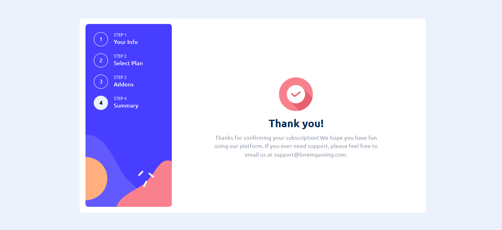

# Frontend Mentor - Multi-step form solution

This is a solution to the [Multi-step form challenge on Frontend Mentor](https://www.frontendmentor.io/challenges/multistep-form-YVAnSdqQBJ). Frontend Mentor challenges help you improve your coding skills by building realistic projects.

## Table of contents

-   [Overview](#overview)
    -   [The challenge](#the-challenge)
    -   [Screenshot](#screenshot)
    -   [Links](#links)
-   [My process](#my-process)
    -   [Built with](#built-with)
    -   [What I learned](#what-i-learned)
    -   [Continued development](#continued-development)
-   [Author](#author)

## Overview

### The challenge

Users should be able to:

-   Complete each step of the sequence
-   Go back to a previous step to update their selections
-   See a summary of their selections on the final step and confirm their order
-   View the optimal layout for the interface depending on their device's screen size
-   See hover and focus states for all interactive elements on the page
-   Receive form validation messages if:
    -   A field has been missed
    -   The email address is not formatted correctly
    -   A step is submitted, but no selection has been made

### Screenshots




### Links

-   Solution URL: [Add solution URL here](https://your-solution-url.com)
-   Live Site URL: [https://multi-step-form-three-neon.vercel.app/](https://multi-step-form-three-neon.vercel.app/)

## My process

### Built withhttps://multi-step-form-three-neon.vercel.app/

-   Semantic HTML5 markup
-   CSS custom properties
-   Flexbox
-   CSS Grid
-   Mobile-first workflow
-   [React](https://reactjs.org/) - JS library
-   [Framer-Motion](https://www.framer.com/motion) - Animation library. Used for form step animations
-   [TailwindCSS](https://tailwindcss.com/) - Utility based CSS Framework for quick and easy styling
-   [Zustand](https://zustand-demo.pmnd.rs/) - For state management.

### What I learned

When I saw the designs for this challenge I knew that I needed some form of global state management. I have used the ContextAPI before and I also know some of its drawbacks, so I decided to try something new that I have heard about: Zustand.

Zustand is a state management solution that is based on hooks and not Consumers and Providers like other state managment solutions. It's easy to setup a global store and it was really helpful to complete this challenge.

I also decided to go an extra mile and add some animations, and what better way to do so that a library I've heard about but haven't used as yet. Framer Motion!

Here is a quick snippet of how I setup framer motion to animate a new step coming in/going out with react and the previous and current Step index.

```tsx
<AnimatePresence key={currentStep}>
    <motion.div
        initial={{
            x: currentStep > prevStep ? "100%" : "-100%",
        }}
        animate={{ x: "0%" }}
        exit={{
            x: currentStep > prevStep ? "-100%" : "100%",
        }}
        transition={{ type: "tween", duration: 0.3 }}
        className='step--container z-10'>
        {steps[currentStep].step}
    </motion.div>
</AnimatePresence>
```

### Continued development

I still have a lot to learn both about global state management with Zustand and how I can do some killer animations with Framer Motions. So I would like to learn more about these technologies and how I can make the best use of them

## Author

-   Website - [Dylan Heslop](https://github.com/dylan-dot-c)
-   Frontend Mentor - [@yourusername](https://www.frontendmentor.io/profile/dylan-dot-c)
